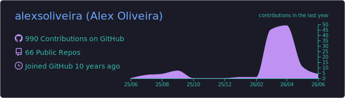
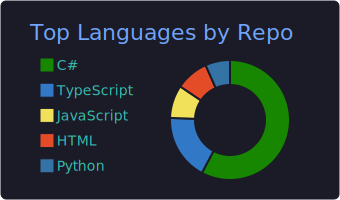
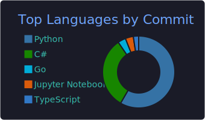
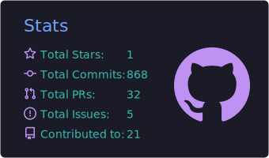

# Olá! Eu sou o Alex Oliveira (https://github.com/alexsoliveira) 👋

Engenheiro de Software com ampla experiência em sistemas críticos nos setores financeiro, aviação e indústria. Especialista na plataforma .NET (Framework e Core) com foco em C#, Web API, SQL Server, Oracle e Angular. Atualmente explorando **IA Generativa** para acelerar estudos e criar soluções inovadoras.

---

## 🚀 Tech Stack

---

## 🏢 Atuação Profissional

- **3CON (Cliente Catepiller)** – Arquiteto/Engenheiro de Software .NET com IA
- **Qintess (Cliente CSN)** – Engenheiro de Software .NET com IA
- **Vericode (Cliente B3)** – Engenheiro de Software .NET  
- **Mazzatech (Cliente GOL)** – Engenheiro de Software .NET  
- **Thomas Greg & Sons do Brasil** – Analista de Sistemas .NET  
- Experiência anterior em grandes empresas como Itaú Unibanco, Amil, Liberty Seguros e Volkswagen Financial Services.

---

## 📱 Especialidades

- Desenvolvimento Back-End em **C# / .NET Framework / .NET Core / Web API**  
- Front-End com **Angular, HTML5, CSS3, JavaScript**  
- Bancos de dados **SQL Server e Oracle**  
- Integração Contínua e Automação (**GitHub Actions / Azure DevOps**)  
- Arquitetura de sistemas, segurança e escalabilidade  
- Fundamentos de **IA Generativa** e **Prompt Engineering**

---

## 🚀 O que me motiva

Atuar em projetos que unam inovação, segurança e alto impacto no negócio.  
Atualmente estudando **IA Generativa** e novas arquiteturas para acelerar a criação de soluções escaláveis, seguras e orientadas a resultados.

---

## 📌 Projetos em Destaque

### 🔹 MBA IA — Pipeline de Ingestão e Busca

Sistema de ingestão de documentos utilizando IA para indexação e recuperação inteligente.

**Stack:** Python, Docker, LangChain, PostgreSQL

🔗 https://github.com/alexsoliveira/mba-ia-desafio-ingestao-busca

---

## 📊 GitHub Analytics

---

## 🤝 Vamos conectar?

* LinkedIn: https://linkedin.com/in/alexsoliveira
* GitHub: https://github.com/alexsoliveira

